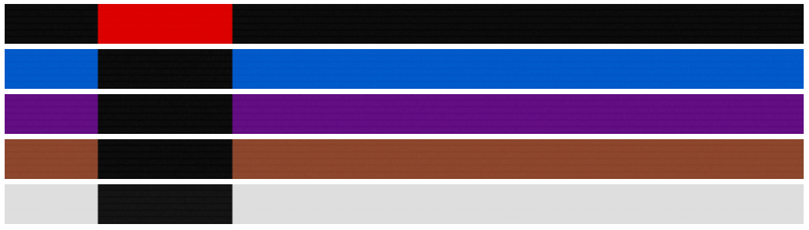

# BJJ Belt Generator

Generate a unique Brazilian Jiu Jitsu belt using ImageMagick.

Each belt input hash produces unique noise artifacts.

## Installation

Install [ImageMagick](https://imagemagick.org/index.php)

Clone this repository and run:
```
yarn install
```

Create `images/temp` and `images/output` subdirectories manually.

## Usage

```
yarn start --color=brown --name=blair --instructor=carlos --academy=cia
```

## Disclaimer

This was hacked together quickly, so the code is somewhat scrappy.

## Example

Example belts generated from command line

